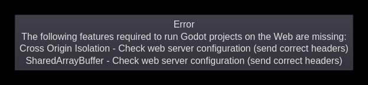

godot\_web
==========

[](https://github.com/pipejakob/godot_web/actions/workflows/build.yaml)
[](https://github.com/pipejakob/godot_web/actions/workflows/test.yaml)

`godot_web` is a minimalistic webserver for testing
[Godot](https://godotengine.org/) HTML builds.

## Why?

Prior to Godot 4.0, HTML builds could be tested using `python -m http.server`
or other simple webservers. However, projects exported to HTML via Godot 4.0
now require the use of Javascript `SharedArrayBuffer`s, which are disabled in
modern browsers unless specific policy headers are set by the webserver to
ensure they can be enabled securely.

You'll know you're in the right place if you see errors like this when trying
to access your builds from a browser:


> Error  
> The following features required to run Godot projects on the Web are missing:  
> Cross Origin Isolation - Check web server configuration (send correct headers)  
> SharedArrayBuffer - Check web server configuration (send correct headers)

## Usage

To get around these errors, just run `godot_web` in the same directory as your
Godot project build:

```shell
$ godot_web
Server link: http://127.0.0.1:8000/
```

Then, open the link in your browser to access your build. `godot_web` will
serve your project files and add the appropriate Cross-Origin HTTP headers so
that `SharedArrayBuffer`s can be enabled securely.

By default, this server will only accept requests from localhost, so it will
not be accessible from remote computers. To change this behavior, you can allow
external traffic via the `--external` flag:

```shell
$ godot_web --external
Server link: https://192.168.0.100:8000/
```

**Note:** when the `--external` flag is given, `godot_web` will generate a
self-signed TLS certificate to serve traffic over HTTPS, which is another
requirement of Godot 4.0 HTML builds that aren't accessed via localhost. If you
want to use your own certificate and private key instead, use the `--tls-cert
<FILE>` and `--tls-key <FILE>` flags.

Don't like the default port (`8000`)? Override it with `--port <PORT>`, like:

```shell
$ godot_web --port 1234
Server link: http://192.168.0.100:1234/
```

For a list of all supported options, run:

```shell
$ godot_web --help
```

## Requirements

[Releases](https://github.com/pipejakob/godot_web/releases) are stand-alone,
static binaries with no external dependencies.

## Building

If you prefer to build from source, you will need [go](https://go.dev/) >= 1.18.

To build the latest version from git, you can clone this repository and run
`make` from its root:

```shell
$ git clone https://github.com/pipejakob/godot_web.git
$ cd godot_web
$ make
```

Or, you can download the source code of a specific
[release](https://github.com/pipejakob/godot_web/releases), unpack it, and run
`make` there:

```shell
$ tar xv godot_web-0.1.tar.gz
$ cd godot_web-0.1
$ make
```

Running `make` from the project root will build the `godot_web` binary in the
current directory.

## Installation

To install, run:

```shell
$ make install
```

and the `godot_web` binary will be placed into `$HOME/go/bin` (make sure this
is in your `$PATH`!).

If you want to install it system-wide, you can copy the binary to a system
folder, like:

```shell
$ make
$ sudo cp godot_web /usr/bin/
```
